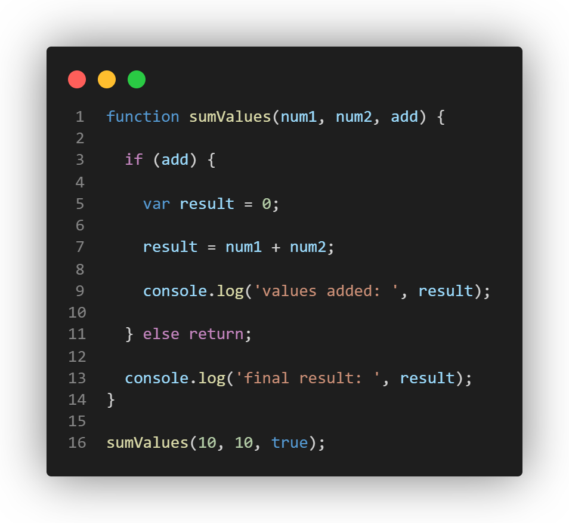

## var declaration

1. What is printed by line 9? If the code returns an error, explain why.

"values added: 20" would be printed.\
There won't be error return because "result" is created in the block.

2. What is printed by line 13? If the code returns an error, explain why. 

"final result: 20" would be printed.\
There won't be error return because variable "result" is visable outside of the block it's created inside the function.

3. Why should you not use var? Explain why. 

Using var can lead to unexpected performance such as returning the wrong thing. Since var is <i>function-scoped</i> instead of <i>block-scoped</i>, it can cause confusing behavior especially the variables are "leak" outside of the block.

4. What is printed by line 9? If the code returns an error, explain why.

"values added: 20" would be printed.\
There won't be error return because "result" is created in the block with "let".

5. What is printed by line 13? If the code returns an error, explain why.

An error would occur here since "let" is block-scoped and not visable outside of if statement.

## const declaration

6. What is printed by line 9? If the code returns an error, explain why.

An error would occur because line 7 trys to change the value of "result" which cannot be changed since it's a const variable.

7. What is printed by line 13? If the code returns an error, explain why.

An error would occur because "result" is block-scoped and not visable outside of if statement.\
However, in this code, we can't even get to here since there's already an error on line 9.