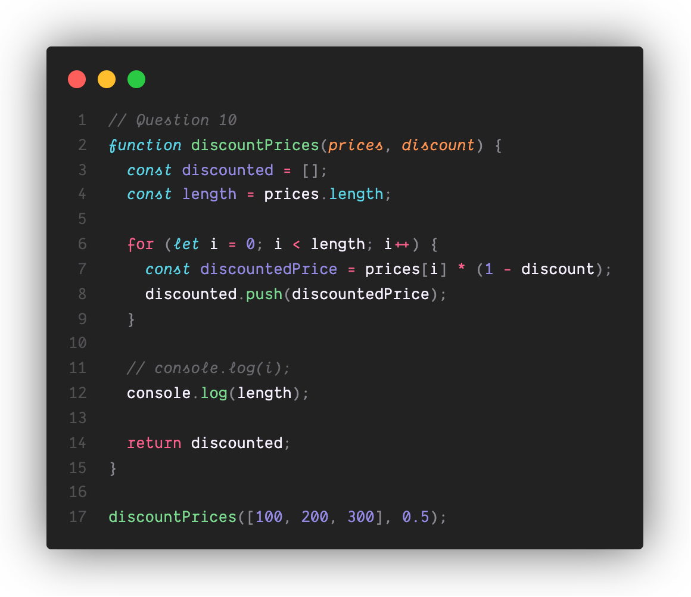
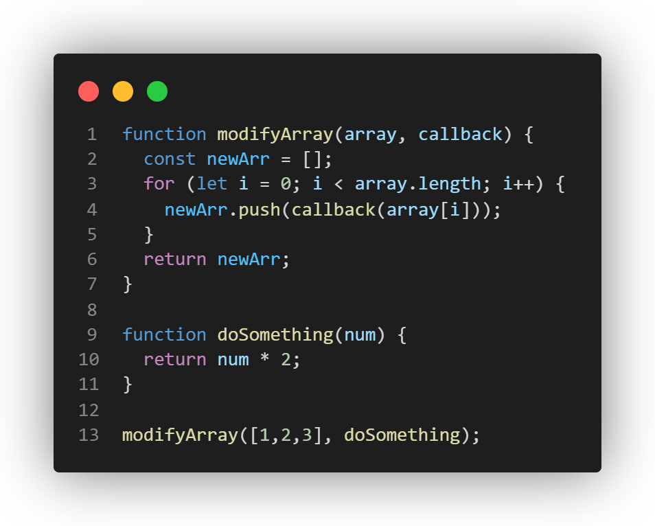

## Questions

1. What will happen at line 12 and why? If the code causes an error, explain why.

    `3` would be printed out without error.\
    Since `i` is a var variable, it is visable outside of the for loop.\
    `3` comes from that after the for loop, i would become 3.

2. What will happen at line 13 and why? If the code causes an error, explain why.

    `150` would be printed out without error.\
    Since "discountedPrice" is a var variable, it is visable outside of the for loop.\
    `150` comes from that after for loop, discountedPrice is on the last one the for loop operated on (which is when i = 2). This is when the price = 300.
    Since discountedPrice = price * (1 - 0.5), discountedPrice = 300 * (1 - 0.5) = 150.

3. What will happen at line 14 and why? If the code causes an error, explain why.

    `150` would be printed out without error.\
    Since "finalPrice" is a var variable, it is visable inside the whole function.\

4. What will this function return? Give a brief explanation why. If the code causes an error, explain why.

    "`50, 100, 150]` would be returned.\
    `discounted` is a var array variable that stores the discountedPrice. After the loop and the calculations, these are the answers.\
    No error would ocurr.\

5. What will happen at line 12 and why?  If the code causes an error, explain why. (assume this function is being called like the others: discountPrices([100, 200, 300], 0.5)).

    An error would ocurr becuase variable `i` is block-scoped and not visable outside of for loop.

6. What will happen at line 13 and why? If the code causes an error, explain why.

    An error would ocurr becuase variable `discountedPrice` is block-scoped and not visable outside of for loop.

7. What will happen at line 14 and why? If the code causes an error, explain why.

    `150` would be printed out since `finalPrice` is declared in the beginning of the function outside for loop. Therefore it's visable in the whole function.\
    `150` comes from the last calculation in for loop.

8. What will this function return? Give a brief explanation. If the code causes an error, explain why.

    `[50, 100, 150]` would be returned without error.\
    `discounted` is a let array variable that stores the discountedPrice and is declared in the beginning of the function outside for loop. Therefore it's visable in the whole function.\
    After the loop and the calculations, these are the answers.\

9. What will happen at line 11 and why? If the code causes an error, explain why.

    An error would occur because `i` is a block-scoped variable and it's not visable outside of for loop.

10. What will happen at line 12 and why? If the code causes an error, explain why.

    `3` would be printed without error.\
    This `3` comes from the length of prices.

11. What will this function return? Give a brief explanation. If the code causes an error, explain why.

    `[50, 100, 150]` would be returned without error.\
    const means the reference of the array cannot be changed but we can still modify its contents. So simply pushing to the array is fine!

## Data Types

12. Given the above Object, write the notation for:\
    a. Accessing the value of the name property in the student object

    `alert(student.name)`

    b. Accessing the value of the Grad Year property in the student object

    `alert(student["Grad Year"])`

    c. Calling the function for the greeting property in the student object

    `student.greeting()`

    d. Accessing the name property of the object in the Favorite Teacher property in student

    `alert(student["Favorite Teacher"].name)`

    e. Access index zero in the array of the courseLoad property of the student object

    `alert(student["courseLoad"][0])`

    
## Basic Operators & Type Conversion 

For each of the following questions, note down the output as well as a brief explanation why that output was given\

13. Arithmetic

    A. '3' + 2 = '32'\
        When using `+`, if one operand is a string, JavaScript converts the other operand to a string and concatenates.

    B. '3' - 2 = 1\
        When using `-`, JavaScript converts both operands to numbers first.

    C. 3 + null = 3\
    `null` is treated as `0` in numeric operations.

    D. '3' + null = '3null'\
    `+` with a string causes string concatenation.

    E. true + 3 = 4\
    `true` becomes 1.

    F. false + null = 0\
    `false` becomes `0`, `null` becomes `0`.

    G. '3' + undefined = '3undefined'\
    `+` with a string causes string concatenation.

    H. '3' - undefined = NaN\
    When using `-`, JavaScript converts both operands to numbers first.
    Number(undefined) = NaN

14. Comparison

    A. '2' > 1 = true\
    Convert '2' into number and 2 is greater than 1.

    B. '2' < '12' = false\
    Both are `strings`, so compares alphabetically, character by character.\
    '2' comes after '1' so '2' should be bigger.

    C. 2 == '2' = true\
    Conver '2' to 2.

    D. 2 === '2' = fasle\
    `===` is strict equality, meaning no type conversion.

    E. true == 2 = false\
    `true` is 1 and 1 is not equal to 2.

    F. true === Boolean(2) = true\
    `Boolean(2)` converts `2` (nonzero) to `true`.\
    true is equal to true.

15. Explain the difference between the == and === operators.
 
    `==` checks for equality `after` converting the operands to the same type `(type coercion)`.\
    `===` checks for equality `without` converting types. Requiring both value and type to be the same `(strict equality)`.

## Functions

17. If the function above is called with the following parameters modifyArray([1,2,3], doSomething), what will be the result? Briefly walk through how you arrived at that result. Here we are passing in a function as a parameter, however we can also return a function from another function just as easily, you're encouraged to play around with callbacks as they are used heavily in frontend JS development. 

    The output would be `[2, 4, 6]`.\
    As we call the function `modifyArray([1,2,3], doSomething)`, we pass in the array `[1,2,3]` and a function `doSomething`.\
    Inside the function `modifyArray()`, it iterates through the array that's being passed in and call function `doSomething` on each of the iterated items.
    As function doSomething `times` the passed item by `2`, after iterating through the whole array, the resulting array `newArr` would then become `[2, 4, 6]`.

19. What is the output of the above code?

    The output would be `1 4 3 2`.\
    The program prints 1 immediately.\ 
    Printing `2` after `1000ms` or `1s` (so wait).\
    Printing `3` after `0ms` (wait also).\
    Prints `4` immediately.\
    Prints `3` before `2` because the wait time is shorter for `3`.